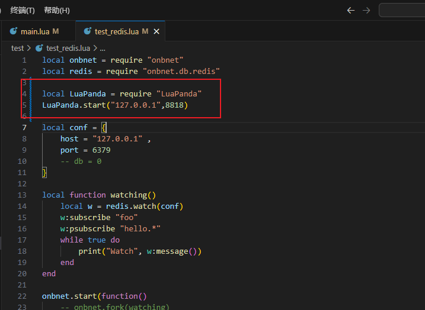
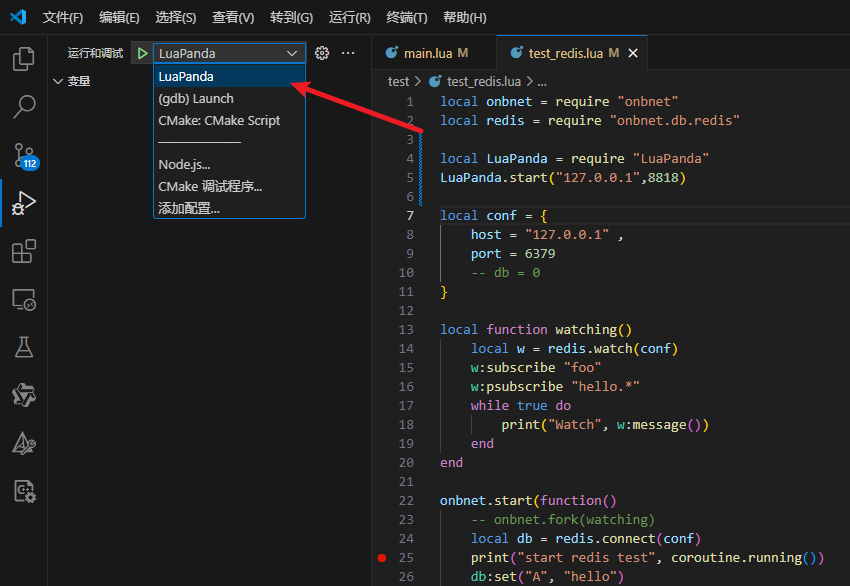
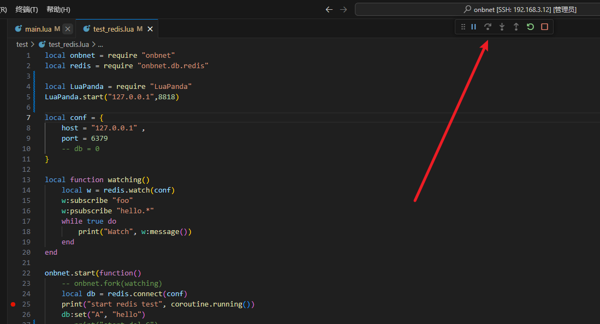
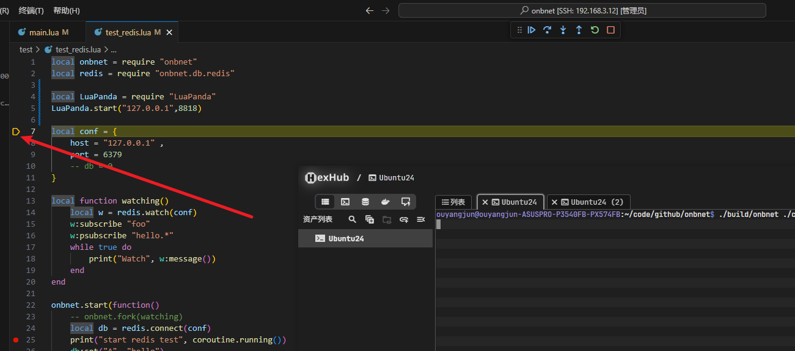
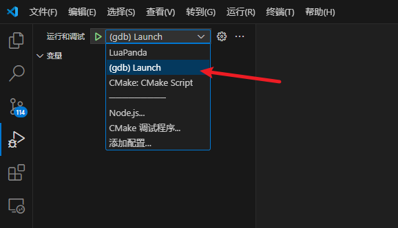
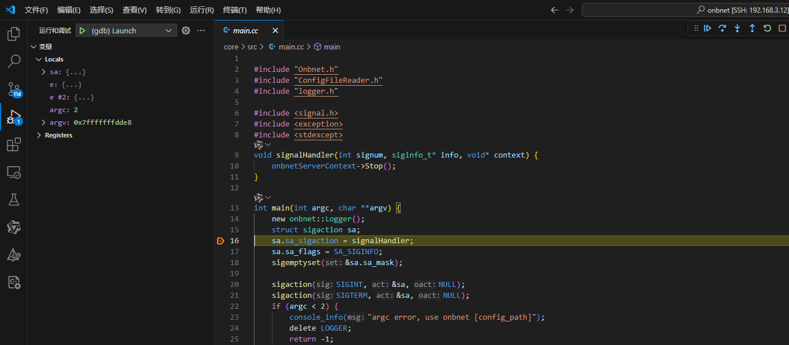

# onbnet
该项目是skynet的C++版本，目的是在复刻skynet功能的过程中来学习skynet的源码，目前来说在写onbnet的代码过程中发现了很多以前阅读skynet源码过程中没有注意的细节，总的来说受益良多。项目底层C++实现并没有完全照搬skynet的C语言实现，其中夹杂了一些私货，但是功能上还是保持了skynet的思路

# 进度
1. 网络部分   (已完成)
2. 线程部分   (已完成)
3. 消息队列   (已完成)
4. actor通信 (已完成)
5. 调试功能   (已完成)
6. 日志功能   (已完成)
7. redis模块   (已完成)
8. mysql模块   (已完成)
9. mongodb模块   (筹备中)
10. 集群模块   (筹备中)
11. kafka模块   (筹备中)
12. 性能测试   (筹备中)

# build
```
1. 拉取依赖
git submodule update --init
2. 编译
mkdir build
cd build
cmake ..
make
```

# 调试

## 调试Lua代码
使用vscode加LuapandaDebug插件，所以你的vscode中需要安装LuapandaDebug插件
1. 在要调试的service对应的lua文件开头添加以下代码


2. 在vscode中选择对应配置


3. 在vscode中f5启动调试


4. 终端启动onbnet, 不出意外你应该断点成功段住了代码


## 调试C++代码
1. 需要安装c++插件，在vscode中选择对应配置


2. 在vscode中f5启动调试


# 最后
最后如果你也喜欢这个项目，请给个star，谢谢！当然如果你也喜欢skynet，请给skynet一个star，谢谢！再最后，如果你有更好的建议，请提issue，欢迎提issue，最后一次在最后如果你也想加入项目请务必联系我，热烈欢迎
